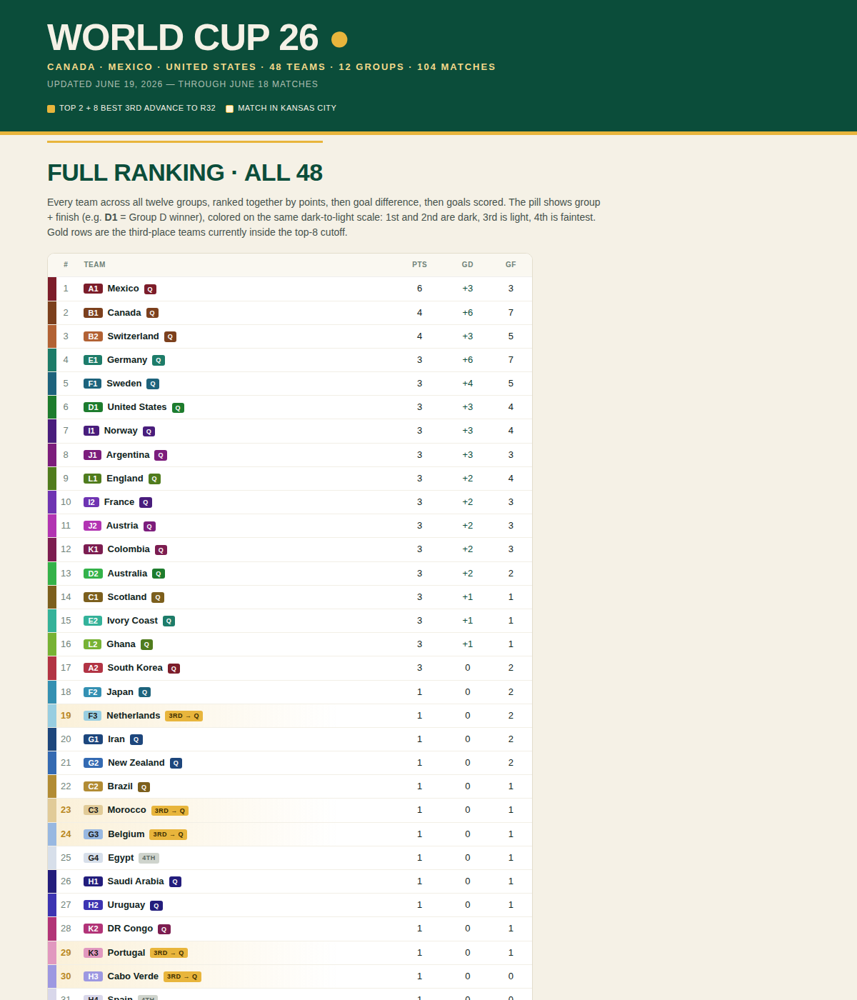

# World Cup 26 — Group Tracker

A static, dependency-free web graphic for the **2026 FIFA World Cup** group
stage. Live standings, head-to-head score matrices, a full 48-team ranking,
and a miniature live bracket — all computed in the browser from one data file.



## Features

- **Full 48-team ranking** — every team ranked together by points, goal
  difference, then goals scored, color-coded by group and finishing position.
- **12 group boxes** — each a single table pairing a triangular head-to-head
  goal matrix with the group standings.
- **Live bracket** — the Round of 32 → Final as it would stand right now,
  rendered as a color map, with the eight best third-place teams slotted via
  FIFA's official Annex C combination matrix (all 495 cases encoded).
- **Color system** — each group has a hue with a dark→light ramp: dark for
  1st/2nd, light for 3rd, faintest for 4th. The same ramp drives the ranking,
  the group boxes, and the bracket so a color maps to one team everywhere.
- **Kansas City matches** flagged throughout (R32 Match 87, QF Match 100).

No backend, no framework, no build step to view.

## Quick start

```bash
git clone <your-repo-url> wc26-tracker
cd wc26-tracker
npm run dev          # http://localhost:8080
```

ES modules require an `http://` origin, so open it through the dev server
rather than double-clicking `index.html`.

## Updating results

All match data lives in [`src/data/fixtures.js`](src/data/fixtures.js). Add a
score to a match once it's played, and bump `AS_OF`:

```js
{md:"Jun 24", h:"CZE", a:"MEX", score:[1,2]},   // played: CZE 1–2 MEX
{md:"Jun 24", h:"RSA", a:"KOR"},                // not played yet
```

Then sanity-check and you're done — every standing, ranking, and bracket slot
recomputes automatically:

```bash
npm run validate
```

## Scripts

| Command | What it does |
|---|---|
| `npm run dev` | Serve the site locally at `http://localhost:8080`. |
| `npm run validate` | Check fixtures (team codes, duplicate matches, score shapes) and the Annex C matrix. |
| `npm run build:palette` | Regenerate `src/css/_palette.generated.css` from `src/data/palette.js`. |

## Project structure

See [`CLAUDE.md`](CLAUDE.md) for a full file map and data-model reference.
Short version:

```
index.html              Page shell
src/data/fixtures.js     ← results live here
src/data/palette.js      group colors (source of truth)
src/data/third-place-map.js   FIFA Annex C matrix
src/js/                  standings, group render, bracket render
src/css/styles.css       all styling
scripts/                 palette build + data validation
```

## Caveats

Group standings use points → goal difference → goals scored. FIFA's further
tiebreakers (head-to-head, fair-play/conduct, FIFA ranking) are **not**
modeled, so order among teams tied on those three metrics is provisional. The
UI states this where relevant.

## License

MIT — see [LICENSE](LICENSE). World Cup data is factual and compiled from
public reporting; this project is not affiliated with FIFA.
